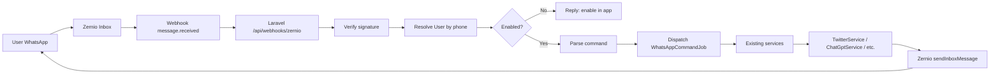

# XEngager WhatsApp Bot — Feature Draft

This is a product design for turning your Zernio WhatsApp number into a **remote control for XEngager Studio**. Users text your business number; the app identifies who they are, runs the action against their connected X account, and replies on WhatsApp.

Built on [Zernio](https://zernio.com/) for WhatsApp inbox + webhooks ([docs](https://docs.zernio.com/platforms/whatsapp), [webhooks](https://docs.zernio.com/webhooks)).

---

## 1. Concept

| Piece | Description |
|--------|-------------|
| **Your WhatsApp number** | One shared XEngager bot number (purchased/verified via Zernio + Meta) |
| **User linking** | Each app user connects their personal WhatsApp so inbound messages map to their account |
| **Opt-in** | Feature is off by default; user enables “WhatsApp Remote Control” in settings |
| **Commands** | Short natural-language or keyword commands that trigger existing app features |
| **Replies** | Bot confirms actions, sends previews, and reports errors back on WhatsApp |

Example flow:

```
User → "post: Just shipped our new feature! 🚀"
Bot  → "✅ Posted to @yourhandle
        https://x.com/yourhandle/status/123..."
```

---

## 2. User Identity & Linking

### 2.1 How we know who is texting

```
WhatsApp message (from +234...) 
  → Zernio webhook (message.received)
  → Lookup user by whatsapp_phone (E.164)
  → If linked + enabled → run command as that user
  → If not linked → send pairing instructions
```

### 2.2 Linking flow (in app)

New settings section: **WhatsApp Remote Control**

1. User toggles **Enable WhatsApp control** (default: off)
2. User enters their WhatsApp number (with country code)
3. App sends a **6-digit verification code** via Zernio to that number
4. User replies with the code (or enters it in the app)
5. On success, store:
   - `whatsapp_phone` (E.164, unique)
   - `whatsapp_verified_at`
   - `whatsapp_bot_enabled` (boolean)
   - optional: `zernio_conversation_id` for faster replies

### 2.3 Security rules

- Only **verified** numbers can run commands
- Require **Twitter/X connected** before any publish/engage action
- Optional **PIN** for destructive commands (`delete`, `disconnect`)
- Message cap per user (default 60/hour, set `WHATSAPP_COMMANDS_PER_HOUR` in `.env`)
- Log every command in `whatsapp_command_logs` (audit trail)
- Verify Zernio webhook signatures (`X-Zernio-Signature`)

### 2.4 Unlink / disable

- Toggle off in app → ignore messages (still receive, reply “feature disabled”)
- `unlink` via WhatsApp or app → clear verification
- Admin can revoke a number if abused

---

## 3. WhatsApp Commands → App Features

Commands can be **keyword-first** (reliable) with **AI fallback** for natural language.

### Tier 1 — High value, ship first

| Command | Maps to | Example |
|---------|---------|---------|
| `help` | — | Lists commands + syntax |
| `status` | Dashboard | X connected?, queued posts count, mentions today |
| `post: {text}` | Chat / Compose | Publish tweet now |
| `schedule: {time} \| {text}` | Queued Posts | `schedule: tomorrow 9am \| Big launch today` |
| `queue` | Queued Posts | List next 5 scheduled posts |
| `delete queue {n}` | Queued Posts | Cancel scheduled post #n |
| `ideas` | Daily Ideas | Send 3 daily ideas |
| `generate: {prompt}` | Generate Ideas | AI ideas from prompt |
| `draft: {text}` | Drafts | Save draft |
| `drafts` | Drafts | List draft previews |

### Tier 2 — Engagement & monitoring

| Command | Maps to | Example |
|---------|---------|---------|
| `mentions` | Mentions | Last 5 mentions (summary + links) |
| `reply {n}: {text}` | Mentions | Reply to mention #n from list |
| `keywords` | Keyword Monitor | Show monitored keywords |
| `add keyword: {word}` | Keyword Monitor | Add keyword |
| `remove keyword: {word}` | Keyword Monitor | Remove keyword |
| `search: {query}` | Keyword Monitor | Top 3 tweets for query |
| `analytics {tweet_id}` | Tweet Analytics | Likes, replies, quotes summary |

### Tier 3 — Automation toggles

| Command | Maps to | Example |
|---------|---------|---------|
| `auto mentions on/off` | Twitter Settings | Toggle AI auto-reply to mentions |
| `auto keywords on/off` | Twitter Settings | Toggle keyword auto-reply |
| `settings` | Twitter Settings | Show limits, auto-reply status |
| `limit {n}` | Twitter Settings | Set daily auto-reply limit |

### Tier 4 — Business & assets

| Command | Maps to | Example |
|---------|---------|---------|
| `auto posts` | Auto Daily Posts | List business profiles + next post time |
| `auto posts on/off` | Auto Daily Posts | Enable/disable profile |
| `assets` | My Assets | List recent asset codes |
| `image: {description}` | AI Image Generation | Generate image, return preview/link |

### Tier 5 — Advanced (later)

| Command | Maps to | Notes |
|---------|---------|-------|
| `thread:` + numbered lines | Thread Creation | Multi-part thread |
| `bookmark {url}` | Bookmarks | Add bookmark |
| `bookmarks` | Bookmarks | List recent |
| `dm campaign: {name}` | Auto DMs | Start/pause campaign |
| `notify me when…` | New | Alert on keyword/mention |

### Natural language mode (optional, Phase 2)

When message doesn’t match a command:

```
"Can you schedule a tweet about our sale for Friday morning?"
→ AI parses intent → confirm → execute
```

Always **confirm destructive or publish actions** unless user sends `!confirm` or has “quick mode” enabled.

---

## 4. Reply Format (WhatsApp-friendly)

Keep replies short, scannable, under WhatsApp limits:

```
📋 *Queued Posts* (3)

1️⃣ Mon 9:00 AM
   "Launch day thread part 1..."
   
2️⃣ Tue 2:00 PM
   "Customer testimonial..."

Reply: delete queue 2
```

For posts with media, send text + image URL (or document link from Cloudinary).

Use WhatsApp formatting: `*bold*`, `_italic_`, numbered lists.

---

## 5. In-App UI (new feature)

### New page: **WhatsApp Settings** (`/whatsapp-settings`)

Sidebar item under Twitter Settings (or grouped as “Integrations”).

**Sections:**

1. **Connection status**
   - Bot number to message: `+1 (415) xxx-xxxx`
   - Your linked number: verified / not verified
   - Last command: time + summary

2. **Enable remote control** (master toggle)

3. **Link WhatsApp**
   - Phone input → Send code → Verify

4. **Permissions** (granular opt-in per category)
   - ☑ Post & schedule
   - ☑ View mentions & analytics
   - ☑ Manage queue & drafts
   - ☐ Automation toggles
   - ☐ Destructive actions (delete, disconnect)

5. **Quick mode**
   - Skip confirmation for `post:` and `schedule:` (power users)

6. **Command log**
   - Last 20 commands with status (success/failed)

7. **Help**
   - Copy-paste cheat sheet to save in WhatsApp

---

## 6. Technical Architecture (Laravel + Zernio)



### New backend pieces

| Component | Purpose |
|-----------|---------|
| `ZernioService` | API client: send messages, list conversations |
| `ZernioWebhookController` | Handle `message.received`, verify HMAC |
| `WhatsAppCommandParser` | Keyword + optional GPT intent parsing |
| `WhatsAppCommandExecutor` | Maps command → existing app logic |
| `ProcessWhatsAppCommand` job | Async execution (webhook returns in &lt;5s) |
| `whatsapp_command_logs` table | Audit + dedupe by `X-Zernio-Event-Id` |
| User columns | `whatsapp_phone`, `whatsapp_verified_at`, `whatsapp_bot_enabled`, permissions JSON |

### Reuse existing code

- **Post now / schedule** → same path as `ChatComponent` + `ProcessScheduledPost`
- **Ideas** → `ChatGptService` + Daily/Generate ideas logic
- **Mentions / keywords** → `TwitterService` + existing Livewire component queries
- **Queue management** → `Post` model (`status = scheduled`)
- **Auto-reply toggles** → `User` flags already on model

### Zernio config

- Subscribe to: `message.received` ([inbox webhooks](https://docs.zernio.com/webhooks))
- Webhook URL: `https://yourdomain.com/api/webhooks/zernio/inbox`
- Alternate (no `/api` prefix): `https://yourdomain.com/webhooks/zernio/inbox`
- Env: `ZERNIO_API_KEY`, `ZERNIO_WEBHOOK_SECRET`, `ZERNIO_WHATSAPP_ACCOUNT_ID`

### 24-hour rule

Users initiate by messaging your number → free-form replies are allowed within 24h ([WhatsApp docs](https://docs.zernio.com/platforms/whatsapp)). For proactive alerts (e.g. “new mention”), use approved **templates** via Zernio broadcasts.

---

## 7. Database sketch

```sql
-- users table additions
whatsapp_phone              VARCHAR(20) UNIQUE NULL
whatsapp_verified_at        TIMESTAMP NULL
whatsapp_bot_enabled        BOOLEAN DEFAULT FALSE
whatsapp_permissions        JSON NULL  -- {post: true, delete: false, ...}
whatsapp_quick_mode         BOOLEAN DEFAULT FALSE
whatsapp_verification_code  VARCHAR(6) NULL
whatsapp_verification_expires_at TIMESTAMP NULL

-- whatsapp_command_logs
id, user_id, zernio_event_id (unique), from_phone, command, 
parsed_intent, status, response_preview, error, created_at
```

---

## 8. Phased rollout

### Phase 1 — MVP (2–3 weeks)
- User linking + verification
- Webhook receiver + Zernio replies
- Commands: `help`, `status`, `post:`, `schedule:`, `queue`, `delete queue`, `ideas`
- In-app WhatsApp Settings page
- Command logging

### Phase 2 — Engagement
- `mentions`, `reply`, `keywords`, `analytics`
- Natural language parsing (GPT)
- Confirmation flow for publish/delete

### Phase 3 — Automation & alerts
- Toggle auto-reply via WhatsApp
- Proactive notifications (new mention, post published/failed) via templates
- Business auto-posts control
- AI image generation from WhatsApp

### Phase 4 — Polish
- WhatsApp Flows for onboarding (Zernio Flows)
- Multi-language commands
- Team accounts (multiple numbers per org)

---

## 9. Example user journeys

**Creator on the go**
```
post: Excited to announce our new course!
→ ✅ Posted. 142 chars. Link: ...
```

**Social manager**
```
queue
→ Shows 4 scheduled posts
delete queue 2
→ ⚠️ Delete "Customer story..." scheduled Tue 2pm? Reply: confirm
confirm
→ ✅ Deleted
```

**First-time user**
```
hello
→ 👋 Link your WhatsApp in XEngager → Settings → WhatsApp Remote Control.
   Or reply with code 482910 if you're verifying now.
```

---

## 10. Risks & mitigations

| Risk | Mitigation |
|------|------------|
| Wrong user executes action | Phone verification + unique index on `whatsapp_phone` |
| Accidental publish | Confirmation unless quick mode |
| Webhook duplicates | Dedupe on `zernio_event_id` |
| Twitter rate limits | Reuse existing caching; friendly WhatsApp error |
| Spam/abuse | Per-user rate limits + disable toggle |
| Long-running AI | Queue job; reply “Processing…” then follow-up message |

---

## 11. Recommended next steps

1. **Confirm command set** — Which Tier 1 commands matter most to you?
2. **Implement Phase 1** — Webhook + linking + `post`/`schedule`/`queue`
3. **Add WhatsApp Settings page** in sidebar
4. **Register Zernio webhook** for `message.received` on your production URL
5. **Test with your verified number** before opening to all users

---

This plan maps directly onto what XEngager already does (compose, queue, ideas, mentions, automation) and uses Zernio only for WhatsApp transport, identity of the sender’s phone number, and replies — not for Twitter, which stays on your existing OAuth integration.

If you want to move forward, I can start with Phase 1: migrations, `ZernioService`, webhook endpoint, and the WhatsApp Settings Livewire page.